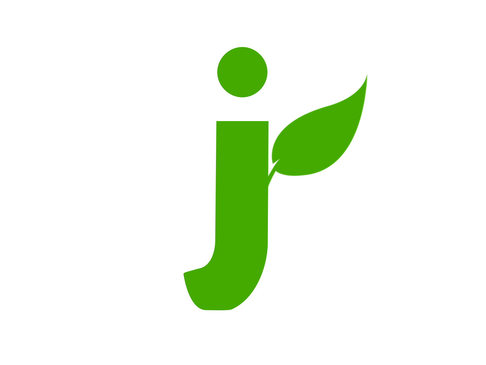

    

---

Jordson is a fully Javascript Framework for building your eCommerce website. Simple, lightweight, high performance and secure. With NodeJS server-side and Single Page Application modern Javascript for the client-side.

>  **Current Version : Aegir-Unstable**

## Useful links

| **Project** | **Community** |
|--------------|---------------|
|[Github](https://github.com/jordson-io/jordson)|[Website](https://www.jordson.io)|
|[Issues](https://github.com/jordson-io/jordson/issues)|[Twitter](https://twitter.com/JORDSONoff)|
|[Road Map](https://github.com/orgs/jordson-io/projects/2)|[Discord](https://discord.gg/zTucuMucwG)|

## Documentation

> **The online documentation is not yet available**

You can find all readme files in the `/docs` folder. You can also run the offline version with [Docsify](https://docsify.js.org/#/).

### Offline documentation

`npm i docsify-cli -g`

`docsify serve docs`

Use the link in the console.

## Support

Jordson is an MIT-Licenced Open Source Project, it can grow thanks to the sponsors and support by the amazing backers, please consider to become Backers / Sponsors on Open Collective (comming soon)

> You can transparently track where your money comes from and where it goes with the [Open Collective](https://opencollective.com) platform.

You can also help Jordson to be more visible, by talking about it around you, put a star on Github or even follow the twitter.

## Contributing

You want to contribute to Jordson project ? There are different ways to help. First of all the project doesn't take any code contribution. Here are some possibilities :

- Report Bugs [Issues](https://github.com/jordson-io/jordson/issues)
- Propose new features [Discord](https://discord.gg/zTucuMucwG)

## License

Jordson is [MIT Licensed](LICENCE)